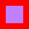

# gem

Color representations and conversions.

[](https://github.com/crates-lurey-io/gem/actions/workflows/test.yml)
[](https://github.com/crates-lurey-io/gem/actions/workflows/docs.yml)
[](https://crates.io/crates/gem)
[](https://codecov.io/gh/crates-lurey-io/gem)

## Layers

`gem` splits into two layers, and you only pay for the one you use.

The **pixel-format layer** (`rgb`, `gray`, `alpha`, `channel`) is memory-layout-accurate types
plus `const` integer channel arithmetic. It needs no math backend, no `std`, and no features, so
a bare `cargo add gem` gets you exactly this.

The **color-space layer** (`space`, `named`, `blend`) is perceptual and working-space types.
Accurate gamma correction (`x^2.4`) and trigonometry need real math, so these are compiled only
when `std` or `libm` is enabled.

```toml
# Pixel formats and channel math only.
gem = "0.2"

# ...plus color spaces, using the standard library's math.
gem = { version = "0.2", features = ["std"] }

# ...plus color spaces, on no_std.
gem = { version = "0.2", default-features = false, features = ["libm"] }
```

## Examples

```sh
cargo run --example draw-png --features bytemuck,std
```

```rust
use gem::prelude::*;

let mut red_box_50x50 = vec![Abgr8888::from_abgr(0xFF, 0x00, 0x00, 0xFF); 50 * 50];

// Make a semi-transparent blue box in the middle of the image
for y in 0..50 {
    for x in 0..50 {
        if (10..40).contains(&x) && (10..40).contains(&y) {
            red_box_50x50[y * 50 + x] = Abgr8888::from_abgr(0x7F, 0x7F, 0x00, 0xFF);
        }
    }
}
```



Channel math is `const`, so a palette or a lighting table can be computed at compile time:

```rust
use gem::rgb::Rgb888;

const GRASS: Rgb888 = Rgb888::from_rgb(200, 180, 60);
const SHADOWED: Rgb888 = GRASS.multiply(Rgb888::from_rgb(128, 128, 128));

assert_eq!(SHADOWED, Rgb888::from_rgb(100, 90, 30));
```

## Rounding

Every integer channel result in this crate is round-to-nearest, ties away from zero. That is a
crate-wide guarantee, exhaustively tested, not a per-function implementation detail.

The cheap alternative, `(v + (v >> 8) + 1) >> 8`, is exactly `floor(v / 255)` for every reachable
input. It biases every channel downward by up to a full step, so an image composited repeatedly
visibly darkens. Nothing here does that.

## Contributing

This project uses [`just`][] to run commands the same way as the CI:

- `cargo just check` to check formatting and lints.
- `cargo just coverage` to generate and preview code coverage.
- `cargo just doc` to generate and preview docs.
- `cargo just test` to run tests.

[`just`]: https://crates.io/crates/just

For a full list of commands, see the [`Justfile`](./Justfile).
